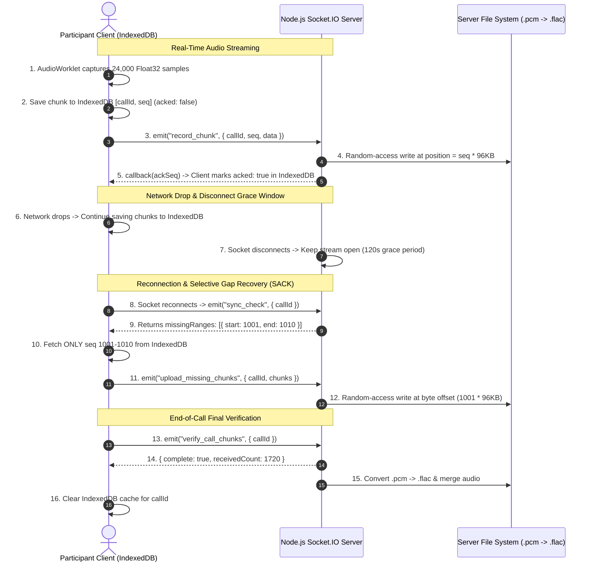

# New Call Logic — DataCatalyst (VocLara)
## Selective Acknowledgement (SACK) & Random-Access Patching Architecture

---

## 1. Overview & Objectives

In real-time audio recording systems, network drops (Wi-Fi re-keying, temporary socket stalls, or ISP blips) can cause lost packets between the client browser and the server. Previously, a socket disconnect resulted in immediate server-side file closure, truncating recordings.

The **SACK (Selective Acknowledgement with Random-Access Patching)** architecture guarantees **100% audio recording integrity** and **sample-accurate synchronization** across participants by combining:

1. **Client-Side Persistent IndexedDB Storage:** All captured Float32 PCM audio chunks are saved locally in the browser's `IndexedDB` database during the call.
2. **Server-Side Random-Access Byte Patching (`r+` mode):** Uncompressed PCM chunk byte offsets are deterministic ($96,000\text{ bytes per chunk}$). The server writes any chunk (whether in-order, out-of-order, or re-transmitted) directly to its exact byte offset:
   $$\text{Offset} = \text{seq} \times 96,000\text{ bytes}$$
3. **Selective Gap-Fill Resynchronization:** When the server detects missing sequence ranges (e.g. `seq 1001 to 1010`), it requests **ONLY** the missing ranges from the client.
4. **End-of-Call Handshake Verification:** Before concluding a call session, the client and server perform a 2-second handshake to verify that 100% of chunks have been received before compiling FLAC audio and uploading to AWS S3.

---

## 2. Architecture Diagram



---

## 3. Data Structures & Formulas

### A. Client IndexedDB Store (`dc_audio_chunks`)
* **Database Name:** `VoclaraAudioDB`
* **Object Store:** `audio_chunks`
* **Primary Key:** `[callId, seq]`
* **Indexes:** `callId`, `acked`
* **Schema:**
  ```javascript
  {
    callId: "call_98234_usr_12",
    seq: 1001,
    data: ArrayBuffer(96000), // Float32 uncompressed PCM (24000 samples * 4 bytes)
    createdAt: 1771485600000,
    acked: false
  }
  ```

### B. Server Deterministic Byte Position Formula
For Float32 mono PCM recorded at 48,000 Hz with 0.5-second chunks (24,000 samples per chunk):
$$\text{bytesPerChunk} = 24,000 \times 4\text{ bytes} = 96,000\text{ bytes } (96\text{ KB})$$

$$\text{Byte Offset in PCM File} = \text{seq} \times 96,000$$

* Chunk `seq = 0` $\rightarrow$ Bytes `0` to `95,999`
* Chunk `seq = 1` $\rightarrow$ Bytes `96,000` to `191,999`
* Chunk `seq = 1001` $\rightarrow$ Bytes `96,096,000` to `97,055,999`

Node.js Random-Access File Descriptor Write:
```javascript
const offset = seq * 96000;
fs.writeSync(fd, buffer, 0, buffer.length, offset);
```

---

## 4. Lifecycle Stages

### Phase 1: Real-Time Ingestion
- `AudioWorklet` captures PCM frames $\rightarrow$ Emits to main thread.
- Main thread assigns incremental `seq` number.
- Saves chunk to `IndexedDB`.
- Emits `record_chunk` to server over Socket.IO.
- Server writes chunk at `seq * 96000` and returns `ACK`.
- Client receives `ACK` and marks `acked: true` in `IndexedDB`.

### Phase 2: Disconnect Grace Window
- When a socket disconnects, the server does **not** finalize the file immediately.
- The stream object remains active in `activeStreams` for a **120-second grace window** (or until the master call session officially ends).
- If the participant reconnects within 120s, the stream resumes without losing past state.

### Phase 3: Selective Resynchronization (SACK)
- Upon socket reconnection or client request:
- Server compares `receivedSeqs` set against `[0 ... maxSeq]`.
- Identifies missing contiguous ranges: e.g. `[{ start: 1001, end: 1010 }]`.
- Server requests these missing ranges from client.
- Client queries `IndexedDB` for ONLY those sequence numbers.
- Client batch-sends missing chunks.
- Server patches them into the `.pcm` file at their exact byte positions in `<1ms`.

### Phase 4: End-of-Call Final Handshake & Cleanup
- When "Hang Up" is clicked, client enters 2-second "Finalizing recording..." state.
- Client performs `verify_call_chunks` handshake with server.
- Once 100% of chunks are confirmed:
  1. Server padding & FLAC compilation runs.
  2. Server uploads FLAC to S3.
  3. Client clears local `IndexedDB` records for that `callId`.

---

## 5. Security & Isolation

* **`callId` + `userId` Keying:**
  All server file handles (`temp_recordings/rec_${callId}_${userId}.pcm`) and client `IndexedDB` records (`[callId, seq]`) are strictly isolated by `callId` and `userId`.
* **Multi-Call Concurrency:**
  Concurrent active calls execute in completely independent file descriptors and stream objects.

---

## 6. Zero Timestamp Lag Lock (Sample-Level Synchronization)

To ensure **0.000 seconds of timestamp lag** between Speaker A and Speaker B (preventing 1198s vs 1198.5s discrepancies):

1. **Master Call Session Clock (`actualCallStartedAt` & `endedAt`):**
   Both speakers are bound to the exact same master timestamps in MongoDB (`CallSession`).
   $$\text{MasterDurationSec} = \frac{\text{endedAt} - \text{actualCallStartedAt}}{1000}$$
2. **Exact Target Byte Lock:**
   $$\text{targetSizeBytes} = \text{MasterDurationSec} \times 48,000 \times 4\text{ bytes}$$
3. **Start & End Padding:**
   * **Start:** Pre-pends digital silence for any delayed start offset relative to `actualCallStartedAt`.
   * **End:** If a participant's raw PCM file is shorter than `targetSizeBytes` (e.g. by 0.5s / 96,000 bytes), the server appends digital silence up to `targetSizeBytes` before FLAC conversion.

**Result:** Both `speaker1.flac` and `speaker2.flac` are guaranteed to have **100% identical sample counts** (down to the microsecond).
