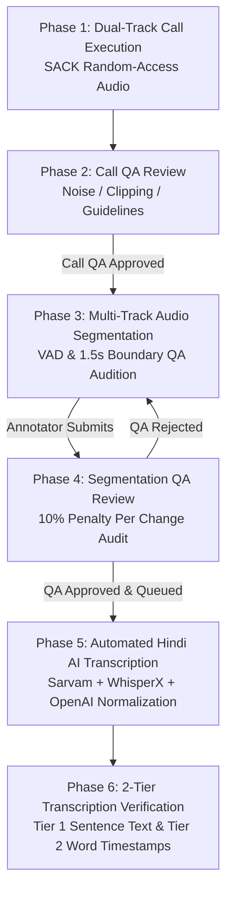
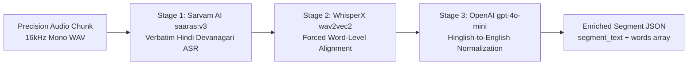

# DataCatalyst (Voclara) — Master Architecture & End-to-End Workflow Specification

This document is the single source of truth for the entire DataCatalyst (Voclara) platform architecture, merging live call execution, fault-tolerant audio ingestion, quality assurance (QA), multi-track audio segmentation, automated pay rate deduction algorithms, and automated Hindi ASR transcription.

---

## Table of Contents
1. [Platform Topology & Service Ports](#1-platform-topology--service-ports)
2. [End-to-End Pipeline Overview](#2-end-to-end-pipeline-overview)
3. [Phase 1: Call Execution & SACK Audio Ingestion](#3-phase-1-call-execution--sack-audio-ingestion)
   - [3.1 WebRTC Live Voice Chat Architecture](#31-webrtc-live-voice-chat-architecture)
   - [3.2 SACK & Random-Access Audio Patching](#32-sack--random-access-audio-patching)
   - [3.3 Zero-Lag Sample-Exact Audio Alignment Algorithm](#33-zero-lag-sample-exact-audio-alignment-algorithm)
   - [3.4 Post-Processing & AWS S3 Export](#34-post-processing--aws-s3-export)
4. [Phase 2: Call Quality Assurance (Call QA)](#4-phase-2-call-quality-assurance-call-qa)
5. [Phase 3: Multi-Track Audio Segmentation (Tier 1)](#5-phase-3-multi-track-audio-segmentation-tier-1)
   - [5.1 Dual-Track Canvas & WaveSurfer Controls](#51-dual-track-canvas--wavesurfer-controls)
   - [5.2 Voice Activity Detection (VAD) Engine](#52-voice-activity-detection-vad-engine)
   - [5.3 Boundary QA Audition (1.5s Start & End)](#53-boundary-qa-audition-15s-start--end)
   - [5.4 Submission & Baseline Snapshotting](#54-submission--baseline-snapshotting)
6. [Phase 4: Segmentation QA Review & Pay Deduction System](#6-phase-4-segmentation-qa-review--pay-deduction-system)
   - [6.1 10% Penalty Per QA Edit Rule](#61-10-penalty-per-qa-edit-rule)
   - [6.2 Role-Aware Canvas Actions (`is_qa=true`)](#62-role-aware-canvas-actions-is_qatrue)
   - [6.3 Glassmorphism QA Rejection Modal](#63-glassmorphism-qa-rejection-modal)
7. [Phase 5: Automated Hindi AI Transcription Pipeline](#7-phase-5-automated-hindi-ai-transcription-pipeline)
   - [7.1 3-Stage AI Engine (`Hindi Transcription.py`)](#71-3-stage-ai-engine-hindi-transcriptionpy)
   - [7.2 Single-Segment On-The-Fly Audio Slicing](#72-single-segment-on-the-fly-audio-slicing)
8. [Phase 6: 2-Tier Transcription Verification & Proofreading](#8-phase-6-2-tier-transcription-verification--proofreading)
   - [8.1 Tier 1: Sentence-Level Text Completeness Check](#81-tier-1-sentence-level-text-completeness-check)
   - [8.2 Tier 2: Word-Level Timestamp Precision Verification](#82-tier-2-word-level-timestamp-precision-verification)
   - [8.3 Live Indic Phonetic Transliteration](#83-live-indic-phonetic-transliteration)

---

## 1. Platform Topology & Service Ports

| Service | Directory | Port | Primary Purpose |
| :--- | :--- | :--- | :--- |
| **VoiceChat Backend** | `voicechat-backend/` | `http://localhost:3001` | Core database (MongoDB), auth, WebRTC signaling, SACK PCM chunk ingestion, session QA review, user management, payouts. |
| **VoiceChat Frontend** | `voicechat-frontend/` | `http://localhost:5173` | Contributor call portal, admin dashboard, call QA auditor table, segmentation QA review drawer. |
| **Labels Backend** | `DataCatalyst_Labels-main/backend/` | `http://localhost:5000` | S3 label storage, ffmpeg audio slicing, segment transcription pipeline orchestration (`Hindi Transcription.py`). |
| **Labels Frontend** | `DataCatalyst_Labels-main/frontend/` | `http://localhost:5174` | Multi-track audio canvas, Tier 1 segmentation editor, Tier 2 word-level transcription & transliteration editor. |

---

## 2. End-to-End Pipeline Overview



---

## 3. Phase 1: Call Execution & SACK Audio Ingestion

### 3.1 WebRTC Live Voice Chat Architecture
* **Capture Constraints:** `navigator.mediaDevices.getUserMedia({ audio: { echoCancellation: false, noiseSuppression: false, autoGainControl: false, sampleRate: 48000, channelCount: 1 } })`.
* **PeerConnection:** WebRTC `RTCPeerConnection` relays live Opus audio between participants.
* **Remote Playback:** Handled via an offscreen HTML5 `<audio>` tag (`position: absolute; width: 1px; height: 1px; opacity: 0; pointerEvents: none;`) to prevent browser rendering engines from muting hidden elements.

```mermaid
sequenceDiagram
    autonumber
    actor UserA as Speaker 1 (User A)
    participant Backend as Express / Socket.IO Server
    participant DB as MongoDB (CallSession)
    actor UserB as Speaker 2 (User B)

    UserA->>Backend: find_match (Language, System Check OK)
    UserB->>Backend: find_match (Language, System Check OK)
    Backend->>UserA: matched (callId, peerId, role: offerer)
    Backend->>UserB: matched (callId, peerId, role: answerer)
    
    rect rgb(30, 41, 59)
    note over UserA, UserB: Topic & Role Negotiation Phase (Max 4 Mins)
    UserA->>Backend: topic_claim (topicId, subtopicId)
    Backend-->>UserB: topic_claimed
    UserA->>Backend: role_selected (Speaker Role)
    UserB->>Backend: role_selected (Speaker Role)
    end

    UserA->>Backend: call_start_initiated
    Backend-->>UserA: call_start_initiated (expectedActualStartTime = now + 5s)
    Backend-->>UserB: call_start_initiated (expectedActualStartTime = now + 5s)

    rect rgb(15, 23, 42)
    note over UserA, UserB: SACK AudioWorklet & IndexedDB Streaming
    UserA->>Backend: record_start (callId, sampleRate: 48000)
    UserB->>Backend: record_start (callId, sampleRate: 48000)
    Backend->>DB: Update recordingAStartedAt / recordingBStartedAt
    Backend-->>UserA: record_ready
    Backend-->>UserB: record_ready
    end

    rect rgb(30, 58, 138)
    note over UserA, UserB: WebRTC Peer-to-Peer Live Voice Chat
    UserA<-- WebRTC Opus Audio -->UserB: Bidirectional Live Conversation
    UserA->>Backend: record_chunk (Float32 PCM at deterministic byte offset)
    UserB->>Backend: record_chunk (Float32 PCM at deterministic byte offset)
    end
```

---

### 3.2 SACK & Random-Access Audio Patching
To ensure **100% audio recording integrity** across network drops or temporary socket stalls:
1. **Client-Side Persistent IndexedDB (`VoclaraAudioDB`):**
   - Every 0.5-second Float32 audio frame (24,000 samples) is stored in browser `IndexedDB` with compound key `[callId, seq]`.
2. **Server-Side Deterministic Random-Access Writing (`r+` mode):**
   $$\text{bytesPerChunk} = 24,000\text{ samples} \times 4\text{ bytes} = 96,000\text{ bytes } (96\text{ KB})$$
   $$\text{Byte Offset in PCM File} = \text{seq} \times 96,000$$
   - The server writes incoming chunks (in-order, out-of-order, or re-transmitted) directly to their exact byte offset:
     ```javascript
     const offset = seq * 96000;
     fs.writeSync(fd, buffer, 0, buffer.length, offset);
     ```
3. **120-Second Disconnect Grace Window:**
   - If a participant drops, the recording stream remains active in memory for 120 seconds.
   - Upon socket reconnection, the client emits `sync_check`. The server detects missing sequences and client batch-uploads only the missing ranges from `IndexedDB`.
4. **End-of-Call Handshake:**
   - Before finalizing the call, client and server execute `verify_call_chunks` to confirm 100% packet parity.

---

### 3.3 Zero-Lag Sample-Exact Audio Alignment Algorithm
When a call concludes, Speaker 1 and Speaker 2 audio files undergo deterministic alignment in `cleanupRecording()` before S3 upload:

1. **Phase 1: Start Silence Prepending (`Pad Start`):**
   - Calculates the start delay relative to the master call start timestamp:
     $$\text{startOffsetSec} = \max\left(0, \frac{\text{recStartTime} - \text{actualCallStartedAt}}{1000}\right)$$
   - Prepends $\text{startSilenceSize} = \text{startOffsetSec} \times 48,000 \times 4\text{ bytes}$ of digital silence (`0x00`) to the beginning of the file.
2. **Phase 2: Master Timestamp Lock & Duration Parity (`Pad End / Trim End`):**
   - The first cleanup execution sets an atomic lock on `session.endedAt` in MongoDB.
   - Computes target file size:
     $$\text{totalCallDurationSec} = \max\left(0, \frac{\text{session.endedAt} - \text{session.actualCallStartedAt}}{1000}\right)$$
     $$\text{targetSizeBytes} = \text{Math.round}(\text{totalCallDurationSec} \times 48,000 \times 4)$$
   - **Under-length:** Appends digital silence up to $\text{targetSizeBytes}$.
   - **Over-length:** Truncates extra disconnect lag using `fs.truncateSync(tempPath, targetSizeBytes)`.

---

### 3.4 Post-Processing & AWS S3 Export
* **FFmpeg 24-bit FLAC Conversion:**
  ```bash
  ffmpeg -f f32le -ar 48000 -ac 1 -i <file>.pcm -sample_fmt s32 <file>.flac
  ```
* **Storage Location:** AWS S3 path `calls/{callId}_{language}_{topic}/speaker1.flac` and `speaker2.flac`.

---

## 4. Phase 2: Call Quality Assurance (Call QA)

1. QA auditors review the dual-track recordings in `voicechat-frontend/src/pages/AdminCalls.jsx`.
2. Auditors check for:
   - Volume levels and background noise floor.
   - Audio clipping or microphone distortion.
   - Conversational guidelines compliance.
3. **Approval Action:**
   - Setting status to `CALL_QA_APPROVED` (`callStatus: 'approved'`) automatically inserts the call into the **TranscriptionCall** pipeline in MongoDB.

---

## 5. Phase 3: Multi-Track Audio Segmentation (Tier 1)

### 5.1 Dual-Track Canvas & WaveSurfer Controls
* **UI Location:** `http://localhost:5174` (**Segmentation Mode**).
* **Dual Channels:** Channel 1 (Speaker 1 WAV, Cyan) & Channel 2 (Speaker 2 WAV, Purple).
* **Independent Controls:** Gain sliders, mute, solo, and stereo pan on each track.
* **Canvas Click-to-Deselect:** Clicking on empty black canvas background outside segments immediately clears `selectionRange` and sets `activeSegmentId = null`.

### 5.2 Voice Activity Detection (VAD) Engine
* **Algorithm:** Energy-envelope VAD analyzes 16kHz audio streams.
* **Parameters:**
  - `minPauseDuration = 0.4s` (Splits utterances at natural pauses $\ge 400$ms).
  - `maxSegmentDuration = 20.0s` (Natural cap avoiding artificially concatenated chunks).
  - `speechPadMs = 150ms` (Protects leading/trailing consonants from clipping).
  - `combineShortSegments = false` (Preserves organic conversational turn boundaries).

### 5.3 Boundary QA Audition (1.5s Start & End)
* **Dynamic Visibility:** Displayed on segments $> 3.5$s at zoom levels $\ge 2.0$x.
* **`▶ 1.5s Start`**: Auditions the opening 1.5 seconds (`[seg.start, seg.start + 1.5]`).
* **`▶ 1.5s End`**: Auditions the ending 1.5 seconds (`[seg.end - 1.5, seg.end]`).
* **Viewport Focus Lock (`isEndAuditionLockedRef`)**:
  - In `▶ 1.5s End` mode, audio playback halts precisely at `seg.end`, and the red playhead remains locked at `seg.end` without resetting focus to `seg.start`.

### 5.4 Submission & Baseline Snapshotting
* Clicking **`🚀 Submit`** performs:
  1. Saves all segment boundary objects to MongoDB (`TranscriptionSegment`).
  2. Stores a baseline snapshot `initial_submitted_segments` in `TranscriptionCall`.
  3. Sets `Segmentation_Done: true`.
  4. Automatically loads the next unsegmented call in queue.

---

## 6. Phase 4: Segmentation QA Review & Pay Deduction System

### 6.1 10% Penalty Per QA Edit Rule
When Admin/QA reviews submitted segmentations in the Admin panel:
* **Diff Algorithm (`calculateSegmentationChanges`)**:
  - Compares current segment boundaries with `initial_submitted_segments`.
  - Boundary modified (start or end shifted $> 150$ms): $+1$ change
  - Segment deleted: $+1$ change
  - Segment added: $+1$ change
  - Speaker re-assigned: $+1$ change
* **Pay Calculation Formula**:
  $$\text{Penalty \%} = \min(100, \text{QA Changes} \times 10\%)$$
  $$\text{User Final Payout \%} = \max(0, 100\% - \text{Penalty \%})$$

| QA Edits Made | Penalty Deducted | Final Annotator Payout |
| :---: | :---: | :---: |
| **0 Edits** | 0% | **100% Payout** |
| **1 Edit** | 10% | **90% Payout** |
| **2 Edits** | 20% | **80% Payout** |
| **3 Edits** | 30% | **70% Payout** |
| **5 Edits** | 50% | **50% Payout** |
| **$\ge 10$ Edits** | 100% | **0% Payout** |

---

### 6.2 Role-Aware Canvas Actions (`is_qa=true`)
When Admin/QA clicks **"Review Segments"** or **"Edit in Canvas"**, the canvas opens with `?is_qa=true`:
* The standard `Submit` button is hidden.
* **`✓ Approve` Button**:
  - Finalizes segment boundaries in MongoDB.
  - Updates `segmentation_qa: true`, `ready_for_transcription: true`, `transcription_status: 'PENDING_TRANSCRIPTION'`.
  - Calculates and persists `qa_changes_count`, `qa_penalty_percentage`, and `qa_payout_percentage`.
  - Moves the call directly into the **Segment-Wise Transcription Queue**.
* **`❌ Reject` Button**:
  - Opens the custom **QA Rejection Modal**.

---

### 6.3 Glassmorphism QA Rejection Modal
* **UI Features:**
  - Dark slate glassmorphism card with red neon accent glow.
  - **Quick-Select Issue Chips:**
    - `+ Utterance boundaries cut speech / clipping words`
    - `+ Too much leading or trailing silence (>300ms)`
    - `+ Incorrect speaker attribution on overlaps`
    - `+ Multiple distinct sentences merged into one`
    - `+ Incomplete segmentation / unsegmented speech`
  - **Feedback Textarea:** Multi-line detailed notes for the annotator.
  - **Action:** Submits rejection to backend (`status: 'rejected'`) and routes call back for revision.

---

## 7. Phase 5: Automated Hindi AI Transcription Pipeline

### 7.1 3-Stage AI Engine (`Hindi Transcription.py`)



1. **Stage 1: Verbatim Hindi ASR (Sarvam AI `saaras:v3`)**:
   - Transcribes 16kHz audio clips with retry handling into verbatim Hindi Devanagari text (`segment_text`).
2. **Stage 2: Forced Word-Level Alignment (WhisperX)**:
   - Uses wav2vec2 Hindi acoustic models to calculate exact sub-second `start` and `end` timestamps for every word.
3. **Stage 3: Hinglish-to-English Normalization (OpenAI `gpt-4o-mini`)**:
   - Converts English loan words transcribed in Devanagari into standard ASCII English spellings while preserving pure Hindi vocabulary.

### 7.2 Single-Segment On-The-Fly Audio Slicing
* **Endpoint:** `GET /api/segmentation/audio-slice/:callId/:speaker?start=X&end=Y`
* **Mechanism:** Uses `ffmpeg -ss {start} -i {remoteWav} -t {duration} -ar 16000 -ac 1` to stream precision 16kHz slices directly to the browser with zero disk overhead.

---

## 8. Phase 6: 2-Tier Transcription Verification & Proofreading

### 8.1 Tier 1: Sentence-Level Text Completeness Check
* Annotator clicks **`Open Transcription Mode →`** on `http://localhost:5174`.
* The client fetches the next approved segment via `GET /api/segmentation/transcription/next-segment`.
* **Action:** Annotator plays the segment audio and reads the continuous `segment_text`.
* **Objective:** Verify that there are no missing words, dropped phrases, or ASR spelling errors.
* **Flag:** Set `tier1_text_verified = true`.

### 8.2 Tier 2: Word-Level Timestamp Precision Verification
* **Action:** Annotator inspects the word array on the waveform (`words: [{ word, start, end }, ...]`).
* **Objective:** Drag and fine-tune word boundaries on the waveform canvas to eliminate bleeding and silence.
* **Flag:** Set `tier2_timestamps_verified = true`.
* **Completion:** When both Tier 1 and Tier 2 are verified, `IsTranscribed = true` is marked.

### 8.3 Live Indic Phonetic Transliteration
* Integrated phonetic transliteration engine across 10 Indic languages (Hindi, Telugu, Tamil, Bengali, Marathi, Kannada, Malayalam, Gujarati, Punjabi, Urdu).
* Provides real-time word suggestion popovers as annotators type in the editor.
